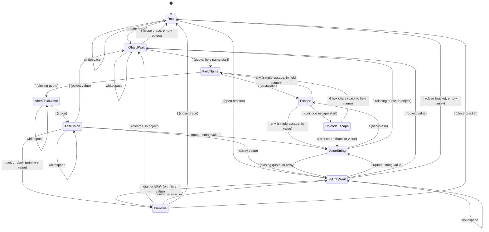

# Parser State Machine

This document describes the state machine used by the streaming JSON parser.

## State Diagram



## State Descriptions

### RootState
**Purpose**: Initial state or between top-level values.

**Transitions**:
- `{` → `InObjectWaitState` - Start parsing a JSON object
- `[` → `InArrayWaitState` - Start parsing a JSON array
- Whitespace (` `, `\t`, `\n`, `\r`) → Stay in `RootState`

### InObjectWaitState
**Purpose**: Inside an object, waiting for field name or end.

**Transitions**:
- `"` → `FieldNameState` - Start parsing a field name
- `}` → `RootState` - End of object (empty object or after last field)
- `,` → Stay in `InObjectWaitState` - Comma before next field
- Whitespace → Stay in `InObjectWaitState`

### FieldNameState
**Purpose**: Parsing a field name (before colon).

**Transitions**:
- `\` → `EscapeState` - Start of escape sequence
- `"` → `AfterFieldNameState` - End of field name

The field name characters are accumulated in the buffer. Escape sequences are decoded before the field name is stored.

### AfterFieldNameState
**Purpose**: Just finished field name, expecting colon.

**Transitions**:
- `:` → `AfterColonState` - Colon before value
- Whitespace → Stay in `AfterFieldNameState`

### AfterColonState
**Purpose**: Just saw colon, expecting value.

**Transitions**:
- `"` → `ValueStringState` - String value
- `{` → `InObjectWaitState` - Nested object value
- `[` → `InArrayWaitState` - Array value
- `0-9` or `t` or `f` or `n` or `-` → `PrimitiveState` - Primitive value (number, boolean, null)
- Whitespace → Stay in `AfterColonState`

### ValueStringState
**Purpose**: Inside a string value.

**Transitions**:
- `\` → `EscapeState` - Start of escape sequence
- `"` → `InObjectWaitState` - End of string value (in object)
- `"` → `InArrayWaitState` - End of string value (in array)
- Any other character → Stay in `ValueStringState` (adds to buffer and sends `on_value_chunk` callback)

### PrimitiveState
**Purpose**: Parsing a number, boolean, or null value.

**Transitions**:
- `,` → `InObjectWaitState` - Comma after primitive in object
- `,` → `InArrayWaitState` - Comma after primitive in array
- `}` → `RootState` - End of object after primitive value
- `]` → `RootState` - End of array after primitive value

Primitive values include: numbers (integers, floats, negative), `true`, `false`, `null`.

### InArrayWaitState
**Purpose**: Inside an array, waiting for value or end.

**Transitions**:
- `"` → `ValueStringState` - String array item
- `{` → `InObjectWaitState` - Object array item
- `[` → Stay in `InArrayWaitState` - Nested array (bracket pushed to stack)
- `0-9` or `t` or `f` or `n` or `-` → `PrimitiveState` - Primitive array item
- `]` → `RootState` - End of array
- `,` → Stay in `InArrayWaitState` - Comma between items
- Whitespace → Stay in `InArrayWaitState`

### EscapeState
**Purpose**: Processing escape sequence `\X`.

**Transitions**:
- `u` → `UnicodeEscapeState` - Unicode escape sequence `\uXXXX`
- Any other character → Back to previous state (`FieldNameState` or `ValueStringState`)

Simple escape sequences:
- `\n` → newline
- `\t` → tab
- `\r` → carriage return
- `\\` → backslash
- `\"` → quote
- `\/` → slash
- `\b` → backspace
- `\f` → form feed

### UnicodeEscapeState
**Purpose**: Processing unicode escape `\uXXXX`.

**Transitions**:
- After 4 hex digits → Back to previous state (`FieldNameState` or `ValueStringState`)

The 4 hex digits are accumulated and decoded to a Unicode character.

## Helper Functions

Several helper functions manage state transitions for complex scenarios:

### `handle_close_brace(parser)`
Handles closing `}` brace:
- Fires `on_array_item_end` if the object is inside an array
- Pops bracket stack and path stack
- Transitions to `InArrayWaitState`, `InObjectWaitState`, or `RootState` based on new stack top

### `handle_close_bracket(parser)`
Handles closing `]` bracket:
- Fires `on_array_item_end` for the last primitive item if applicable
- Fires `on_field_end` for the completed array
- Pops bracket stack and path stack
- Transitions to `InArrayWaitState`, `InObjectWaitState`, or `RootState`

### `check_primitive_array_item_end(parser, last_char)`
Checks if a primitive item in an array just ended.
Fires `on_array_item_end` for the completed item.

### `check_primitive_array_item_end_on_seperator(parser)`
Similar to above, but checks by looking backward from comma or `]` to find the last non-whitespace character.

## State References

Each state maintains references to:
- `parser` - The parent parser
- `tracker` - Manages bracket stack, path stack, context buffer
- `handler` - Callback interface
- `buffers` - Buffer manager for field names, strings, unicode sequences

## Example Parsing Flow

For JSON: `{"name": "value"}`

```
Root --'{'--> InObjectWait
InObjectWait --'"'--> FieldName
FieldName --'n','a','m','e'--> FieldName (accumulating)
FieldName --'"'--> AfterFieldName (field_name = "name")
AfterFieldName --':'--> AfterColon
AfterColon --'"'--> ValueString
ValueString --'v','a','l','u','e'--> ValueString (accumulating + chunks)
ValueString --'"'--> InObjectWait
InObjectWait --'}'--> Root
```

## Notes

- **Whitespace handling**: Most states ignore whitespace without transitioning
- **Nested structures**: Bracket stack tracks nesting depth for `{` and `[`
- **Path tracking**: Path stack builds JSONPath-like strings for callbacks
- **Callbacks**: State transitions trigger appropriate handler callbacks (`on_field_start`, `on_field_end`, `on_array_item_start`, `on_array_item_end`, `on_value_chunk`)
- **Context buffer**: All parsed characters are stored for value extraction
